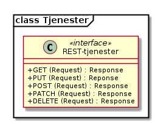
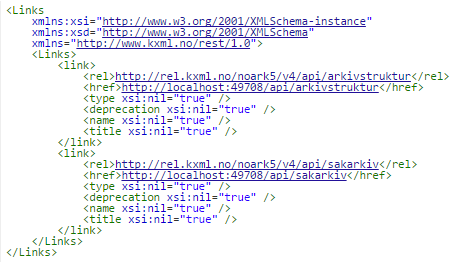
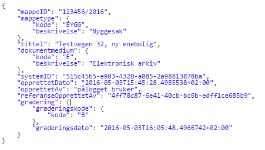
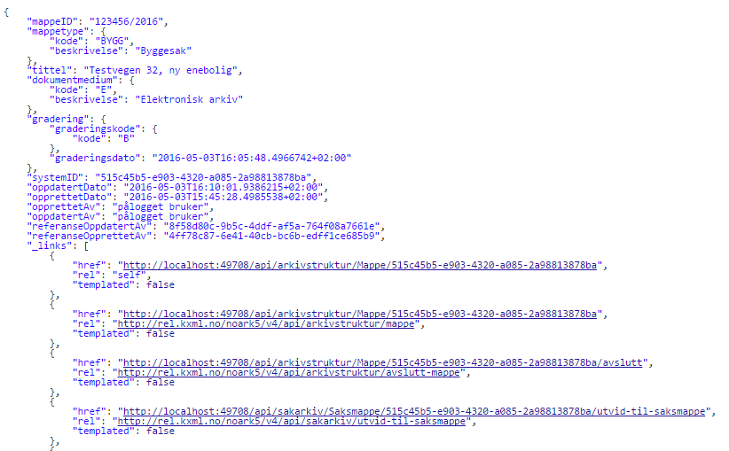

# Konsepter og prinsipper

## Utforming av tjenester

Mandatet til prosjektgruppen var å etablere CRUD tjenester (Create,
Read, Update, Delete) for NOARK5 standarden. Både tjenestene og
datastrukturer er modellert i UML.

De aller fleste objekter i NOARK trenger operasjoner/tjenester for å
opprette objekt, finne objekter, oppdatere objekter og i noen spesielle
tilfeller slette objekter. I noen av kravene i NOARK er det også
beskrevet egne tjenester som skal kunne utføres.

Det er valgt å spesifisere REST for tjenestene. Prinsippene og eksempler
følger under, og ytterligere detaljer kan en finne i vedlegg 3.

### REST tjenestene

For REST er HATEOAS prinsipper fulgt slik at en klient skal fra en hoved
url kunne navigere og oppdage selv alle mulig tjenester som kjernen
tilbyr.

Dette gjøres med ressurslenker og relasjonslenker som inneholder
beskrivelse av ressursen med eksempler på forespørsler, resultat og
statuskoder.

Under følger eksempler fra tjenestene.

#### Oppkobling og ressurslenker

Oppkobling skjer mot en hoved url og er den eneste ressursen klienten
trenger å vite for å starte interaksjon. Resten av endepunkter oppdages
av klienten via relasjonsnøkler som beskriver hva ressursen kan brukes
til.

**Request**

GET http://localhost:49708/api

Accept: application/vnd.noark5-v4+json

**Response**

Content-Type: application/vnd.noark5-v4+json

Eksempelet viser at denne arkivkjernen støtter arkivstruktur
(http://rel.kxml.no/noark5/v4/api/arkivstruktur) og sakarkiv
(http://rel.kxml.no/noark5/v4/api/sakarkiv).
Ved å følge Href til disse relasjonsnøkler vil tilgjengelige ressurser
innen disse områder annonseres på samme måte.

**Resultatkoder**

| Statuskode | Beskrivelse                        |
| ---------- | ---------------------------------- |
| 200        | OK                                 |
| 400        | BadRequest - ugyldig forespørsel   |
| 403        | Forbidden - ingen tilgang          |
| 404        | NotFound - ikke funnet             |
| 501        | NotImplemented - ikke implementert |

Alternativt som XML

**Request**

GET http://localhost:49708/api

Accept: application/vnd.noark5-v4+xml

**Response**

Content-Type: application/vnd.noark5-v4+xml

­­­«href» kan være hva som helst og trenger ikke følge noe fast mønster
for oppbygning av url. Mens «rel»(relasjonsnøkkelen) har faste verdier
som beskriver hva ressursen kan brukes til. Denne kan klienten også åpne
for å vise beskrivelse, eksempel på bruk, statuskoder og annet som er
relevant for denne relasjonsnøkkelen.

**Relasjonsnøkler på
rotnivå**

| Relasjonsnøkkel (rel)                          | Beskrivelse                                            |
| ---------------------------------------------- | ------------------------------------------------------ |
| http://rel.kxml.no/noark5/v4/api/arkivstruktur | Arkivkjerne støtter konformitetsnivå 1 arkivstruktur   |
| http://rel.kxml.no/noark5/v4/api/sakarkiv      | Arkivkjerne støtter konformitetsnivå for sakarkiv (2a) |

Relasjonsnøkler under de forskjellige konformitetsnivå listes ut i
kapittel 7 sammen med beskrivelse av klasser.

**Spesielle
relasjonsnøkler**

| Relasjonsnøkkel (rel)                                  | Beskrivelse                                                                      |
| ------------------------------------------------------ | -------------------------------------------------------------------------------- |
| [self](http://rel.kxml.no/noark5/v4/api/arkivstruktur) | Brukes for å identifisere en ressurs, og kan brukes til oppdatering og sletting. |
| next                                                   | Brukes for å angi neste side ved serverstyrt resultatoppdeling                   |

Ressurser bør kun gjøres tilgjengelig i API når pålogget bruker har
tilgang til disse. Hvis en bruker ikke har tilgang til å avslutte en
mappe så bør ikke relasjonsnøkkel for dette annonseres i API for å gjøre
det lettere å navigere til aktuelle funksjoner.

#### Finne objekter (Read)

For filter skal syntaks fra oData standarden
(http://docs.oasis-open.org/odata/odata/v4.0/os/part2-url-conventions/odata-v4.0-os-part2-url-conventions.html\#\_Toc372793790)
benyttes. De ressurser som støtter filter skal annonserer dette under
\_links med «templated=true» og parametre som kan brukes til dette i
«href». Typiske parametre er $filter, $top, $skip og $orderby. Alle
lister med data bør støtte søk og filtrering.

Figur anonsering av templated link for søk etter arkiv

Filter parametre som skal støttes er:

  - $filter
  - $top
  - $skip
  - $search
  - $orderby

**Nivå på filter**

  - Nivå basis (påkrevd):
      - Filter på direkte felter.
      - Filter på en-til-en gruppe relasjoner (blant annet kodelister)
  - Nivå utvidet:
      - Filter på en-til-mange relasjoner (vha. 'any' og 'all' odata
        funksjonene)

**Filtrering**

Filtrering støttes med $filter
parameter.

| Operasjon            | Syntaks                       | Eksempel                                                                                                                                                                        |
| -------------------- | ----------------------------- | ------------------------------------------------------------------------------------------------------------------------------------------------------------------------------- |
| Begynner med         | startsWith(feltnavn, ‘tekst’) | [.../mapper?$filter=startsWith(tittel, 'test'](http://n5test.kxml.no/api/arkivstruktur/Arkivdel/1235/mappe?$top=2&$filter=tittel%20eq%20%E2%80%98testmappe%E2%80%99))           |
| Er lik               | Feltnavn eq verdi             | .../arkiv?$filter=systemID eq '123456789'                                                                                                                                       |
| Inneholder           | contains(feltnavn, ‘tekst’)   | [../arkivdel/1235/mappe?$filter=contains(tittel, ‘test’)](http://n5test.kxml.no/api/arkivstruktur/Arkivdel/1235/mappe?$top=2&$filter=tittel%20eq%20%E2%80%98testmappe%E2%80%99) |
| Større enn           | Feltnavn gt verdi             | ../arkivstruktur/registrering/?$filter=year(oppdatertDato) gt 2012                                                                                                              |
| Mindre enn           | Feltnavn lt verdi             | ../arkivstruktur/registrering/?$filter=year(oppdatertDato) lt 2014                                                                                                              |
| Større enn eller lik | Feltnavn ge verdi             | ../arkivstruktur/registrering/?$filter=year(oppdatertDato) ge 2012                                                                                                              |
| Mindre enn eller lik | Feltnavn le verdi             | ../arkivstruktur/registrering/?$filter=year(oppdatertDato) le 2014                                                                                                              |
| Og                   | Uttrykk and uttrykk           | ../arkivstruktur/registrering/?$filter=year(oppdatertDato) gt 2012 and year(oppdatertDato) lt 2014                                                                              |
| Eller                | Uttrykk or uttrykk            | ../arkivstruktur/registrering/?$filter=year(oppdatertDato) gt 2012 or year(oppdatertDato) lt 2014                                                                               |

**Filter
eksempler**

| Eksempel                                                                                                                                                                                                                        | Forklaring                                                                                              | Nivå    |
| ------------------------------------------------------------------------------------------------------------------------------------------------------------------------------------------------------------------------------- | ------------------------------------------------------------------------------------------------------- | ------- |
| [../1235/mappe?$top=2&$filter=tittel eq 'testmappe'](http://n5test.kxml.no/api/arkivstruktur/Arkivdel/1235/mappe?$top=2&$filter=tittel%20eq%20%E2%80%98testmappe%E2%80%99)                                                      | De to første mapper med tittel testmappe                                                                | basis   |
| ../arkivstruktur/arkiv?$search='test'                                                                                                                                                                                           | Arkiv som inneholder test – implementasjonen kan tolke selv hva som skal søkes mot av felter og innhold | basis   |
| ../arkivstruktur/mappe/?$filter=gradering/graderingskode/kode eq 'B'                                                                                                                                                            | Mapper med graderingskode B                                                                             | basis   |
| ../arkivstruktur/mappe/?$expand=merknad&$filter=merknad/any(m: m/merknadstype/kode eq 'B')                                                                                                                                      | Mapper med merknader som har merknadstype B                                                             | utvidet |
| [../arkivdel/1235/mappe?$top=2&$filter=contains(‘testmappe’, tittel) eq true](http://n5test.kxml.no/api/arkivstruktur/Arkivdel/1235/mappe?$top=2&$filter=tittel%20eq%20%E2%80%98testmappe%E2%80%99) $orderby=oppdatertDato desc | De to første mapper hvor testmappe er en del av tittel sortert synkende på oppdatertDato                | basis   |
| ../api/arkivstruktur/Mappe?$filter=klasse/klasseID eq '12/2' and klasse/klassifikasjonssystem/klassifikasjonstype/kode eq 'GBNR'                                                                                                | Mappe med klassering på eiendom                                                                         | utvidet |
| ../api/arkivstruktur/Mappe?$filter=klasse/klasseID eq '12345678901' and klasse/klassifikasjonssystem/klassifikasjonstype/kode eq 'PNR'                                                                                          | Mappe med klassering på fødselsnr                                                                       | utvidet |
| ../api/arkivstruktur/Mappe?$filter=klasse/klasseID eq '123456789' and klasse/klassifikasjonssystem/klassifikasjonstype/kode eq 'ORG'                                                                                            | Mappe med klassering på organisasjonsnr                                                                 | utvidet |
| ../api/sakarkiv/Saksmappe/?$filter=sakspart/any(s:s/Default.SakspartPersonType/foedselsnummer eq '12334566')                                                                                                                    | Saksmapper med sakspart(SakspartPerson) med gitt fødselsnr                                              | utvidet |
| ../api/sakarkiv/Saksmappe/?$filter=sakspart/any(s:s/Default.SakspartEnhetType/organisasjonsnummer eq '12334566')                                                                                                                | Sakspart med organisasjonsnr                                                                            | utvidet |
| ..api/sakarkiv/journalpost/?$filter=korrespondansepart/any(s:s/Default.KorrespondansepartPersonType/foedselsnummer eq '12334566')                                                                                               | Korrespondansepart med fødselsnummer                                                                    | utvidet |
| ..api/arkivstruktur/mappe/?$filter=nasjonalidentifikator/any(i: i/Default.BygningType/byggidentifikator/bygningsNummer eq '12345678')                                                                                           | Nasjonal identifikator med bygningsnr                                                                   | utvidet |

**Søk**

$search brukes for generelt søk. Arkivkjernen bestemmer hvordan denne er
implementert med hensyn på hvilke felter den inkluderer i søk og om for
eksempel innhold i dokumenter er med.

**Sortering**

$orderby brukes for å angi sortering av resultat etter gitte felter.

**Resultatoppdeling (Paginering)**

På klientsiden kan $top og $skip brukes sammen for å angi hvilken side
av søkeresultatet en ønsker returnert. $top gir antallet som skal
returneres, og $skip gir antallet en skal hoppe over og ikke inkludere i
resultatet.

Serverstyrt resultatoppdeling kan settes av arkivkjernen med PageSize.
Pagesize setter max antall som kan returneres fra arkivkjerne og kjerne
må returnere en next link som gir neste siden.

**Filter på underobjekter**

Any eller All brukes for å filtrere på navigerbare objekter. Det kan
være begrensninger på hvor mange nivå/dybde en arkivkjerne støtter.

**Resultat med underobjekter**

$expand brukes for å inkludere underobjekter i resultat. Det kan være
begrensninger på hvor mange nivå en arkivkjerne støtter. Som standard
skal ikke underobjekter returneres hvis dette ikke spesifiseres med
$expand. Hvor mange nivåer som støttes settes opp i kjernen med
MaxExpansionDepth.

**Filter og tilgangsstyring**

Ved søk skal arkivkjernen ta hensyn til tilgangsrettigheter slik at
brukere ikke får uautorisert tilgang til informasjon. Er informasjonen
unntatt offentlighet, skjermet eller gradert så skal ikke uautoriserte
brukere få tilgang til dette. Dette kan bety at en bruker har lov til å
registrere et objekt, men ikke rettigheter til å vise dette etterpå.

Resultatkoder ved navigering/søk

| Statuskode | Beskrivelse                                   |
| ---------- | --------------------------------------------- |
| 200        | OK                                            |
| 400        | BadRequest - ugyldig forespørsel              |
| 403        | Forbidden - ingen tilgang                     |
| 404        | NotFound - ikke funnet                        |
| 500        | InternalServerError – generell feil på server |
| 501        | NotImplemented - ikke implementert            |

#### Opprette objekter (Create)

For å opprette objekter må først ressurslenke finnes basert på
relasjonsnøkkel.

For eksempel kan en opprette mapper på arkivdel, og da vil \_Links under
en arkivdel inneholde relasjonsnøkkelen
rel=»http://rel.kxml.no/noark5/v4/api/arkivstruktur/ny-mappe/»
om bruker har lov til å opprette mapper på denne arkivdelen. Den
aktuelle ressurslenke kan være
http://n5test.kxml.no/api/arkivstruktur/Arkivdel/12345/ny-mappe .
Denne kan brukes til både GET og POST forespørsel.

GET forespørselen forhåndsutfyller en lovlig objektstruktur og gir
relasjonslenker til aktuelle kodelister.

Klienten sender en POST forespørsel med en lovlig objektstruktur til
gitt url. Responsen gir statuskode 201 Created om objektet ble opprettet
korrekt og komplett objekt samt location header for lese eller endre
url.

POST til http://n5test.kxml.no/api/arkivstruktur/Arkivdel/12345/ny-mappe

Content-Type: application/vnd.noark5-v4+json

**Resultat**

201 Opprettet

Location
→

http://localhost:49708/api/arkivstruktur/Mappe/a043d07b-9641-44ad-85d8-056730bc89c8

Figur respons fra opprett mappe (eksempel avkortet for liste over links)

Resultatkoder ved oppretting av objekt

| Statuskode | Beskrivelse                                   |
| ---------- | --------------------------------------------- |
| 200        | OK                                            |
| 201        | Created - opprettet                           |
| 400        | BadRequest - ugyldig forespørsel              |
| 403        | Forbidden - ingen tilgang                     |
| 404        | NotFound - ikke funnet                        |
| 409        | Conflict – objektet kan være endret av andre  |
| 500        | InternalServerError – generell feil på server |
| 501        | NotImplemented - ikke implementert            |

Heleide objekter(komposisjoner) kan opprettes sammen med hovedobjektet
og inngår i dens lovlige objektstruktur. For eksempel merknad på en
mappe kan registreres sammen med registreringen av mappe.

#### Preutfylling av objekt

Ved å bruke GET på for eksempel ny-mappe
(http://rel.kxml.no/noark5/v4/api/arkivstruktur/ny-mappe/)
så kan arkivkjerne preutfylle og foreslå vanlige data for et objekt
basert på pålogget bruker samt annonsere hvor diverse lovlige koder kan
hentes fra slik som mappetype og dokumentmedium.

#### Oppdatere objekter (Update)

Alle ressurser kan med sin relasjonslenke rel=»self» og ressurslenke
(href) benytte denne til oppdatering.

For oppdatering sender klienten en PUT forespørsel med alle data for en
lovlig objektstruktur. Alle egenskaper må være med, med unntak av
underobjekter som har en mange relasjon (0..\* eller 1..\*) i
oppdatering av et objekt. Underobjekter må oppdateres separat med sine
resurslenker.

PUT til http://n5test.kxml.no/api/arkivstruktur/Mappe/a043d07b-9641-44ad-85d8-056730bc89c8

Content-Type: application/vnd.noark5-v4+json

**Resultat**

200 OK

Location →

http://localhost:49708/api/arkivstruktur/Mappe/a043d07b-9641-44ad-85d8-056730bc89c8

Figur respons fra oppdatering av mappe med graderingsinformasjon
(eksempel avkortet ved links liste)

Resultatkoder ved oppdatering av objekt

| Statuskode | Beskrivelse                                   |
| ---------- | --------------------------------------------- |
| 200        | OK                                            |
| 400        | BadRequest - ugyldig forespørsel              |
| 403        | Forbidden - ingen tilgang                     |
| 404        | NotFound - ikke funnet                        |
| 409        | Conflict – objektet kan være endret av andre  |
| 500        | InternalServerError – generell feil på server |
| 501        | NotImplemented - ikke implementert            |

#### Oppdatere referanser mellom objekter

Relasjoner kan angis ved tildelte attributter eller via plassering på
gitt url. For eksempel ny mappe knyttes til arkivdel ved at url til ny
mappe også inneholder hvilke arkivdel denne skal opprettes på. Egne
attributter kan for eksempel være referanseForeldremappe for å lage
undermapper.

Mer generelt kan klienter benytte href for rel=self for aktuelle
objekter sammen med $ref parameter for å slette, endre eller opprette
referanser mellom objekter.

**For å opprette ny referanse**

POST
http://localhost:49708/api/arkivstruktur/registrering/cf8e1d0d-e94d-4d07-b5ed-46ba2df0465e/dokumentbeskrivelse/$ref?$id=http://localhost:49708/api/arkivstruktur/Dokumentbeskrivelse/1fa94a89-3550-470b-a220-92dd4d709044

Resultatkode 204 – noContent

Her opprettes ny referanse mellom registrering og dokumentbeskrivelse.

**For å oppdatere/flytte referanse**

PUT
http://localhost:49708/api/arkivstruktur/registrering/cf8e1d0d-e94d-4d07-b5ed-46ba2df0465e/dokumentbeskrivelse/$ref?$id=http://localhost:49708/api/arkivstruktur/Dokumentbeskrivelse/1fa94a89-3550-470b-a220-92dd4d709044

Body:

http://localhost:49708/api/arkivstruktur/Dokumentbeskrivelse/092e497a-a528-4121-8f22-fbc78fa6c930

Resultatkode 200 – OK

Her flyttes registreringen fra en dokumentbeskrivelse til en annen.

**For å slette en referanse**

DELETE
http://localhost:49708/api/arkivstruktur/registrering/cf8e1d0d-e94d-4d07-b5ed-46ba2df0465e/dokumentbeskrivelse/$ref?$id=http://localhost:49708/api/arkivstruktur/Dokumentbeskrivelse/092e497a-a528-4121-8f22-fbc78fa6c930

Resultatkode 204 – noContent

Her slettes referansen til dokumentbeskrivelse fra registrering.

Resultatkoder ved oppdatering av referanser til objekt

| Statuskode | Beskrivelse                                   |
| ---------- | --------------------------------------------- |
| 200        | OK                                            |
| 204        | NoContent                                     |
| 400        | BadRequest - ugyldig forespørsel              |
| 403        | Forbidden - ingen tilgang                     |
| 404        | NotFound - ikke funnet                        |
| 409        | Conflict - objektet kan være endret av andre  |
| 500        | InternalServerError – generell feil på server |
| 501        | NotImplemented - ikke implementert            |

#### Slette objekter (Delete)

Klienten sender en DELETE forespørsel på aktuell ressurs(url). Alle
ressurslenker med rel=»self» kan potensielt slettes om bruker har
nødvendige rettigheter. Respons gir statuskode 204 om ressursen er
korrekt slettet.

Et viktig krav i Noark 5 er at arkiverte elektroniske dokumenter ikke
skal kunne slettes. Kontrollert sletting skal bare kunne foretas av
autoriserte brukere i forbindelse med kassasjon

Sletting av Arkivdel – Kan også gjøres med oppdatering av arkivdel hvor
det legges inn informasjon om sletting.

Sletting av Dokumentbeskrivelse – her er flere type sletting så må
gjøres med oppdatering?

De som ikke har sletting datatype, hvordan skal de merkes/fjernes?Krav
om logging nok?Skal ikke være mulig å slette uansett hvor mye
rettigheter en bruker har? – Arkivverket må avklare dette

Resultatkoder ved sletting av objekt

| Statuskode | Beskrivelse                                   |
| ---------- | --------------------------------------------- |
| 200        | OK                                            |
| 204        | NoContent – slettet ok                        |
| 400        | BadRequest - ugyldig forespørsel              |
| 403        | Forbidden - ingen tilgang                     |
| 404        | NotFound - ikke funnet                        |
| 409        | Conflict - objektet kan være endret av andre  |
| 500        | InternalServerError – generell feil på server |
| 501        | NotImplemented - ikke implementert            |

#### Overføringsformat

Innholdstyper(Content-Type) som skal brukes:

| Innholdstype (Content-Type)    |
| ------------------------------ |
| application/vnd.noark5-v4+json |
| application/vnd.noark5-v4+xml  |

Overføringsformat skal være i henhold til følgende skjema for begge
innholdstyper:

  - http://skjema.kxml.no/arkivverket/noark5/v4.0/

Datoformat skal være angitt ihht http://www.w3.org/TR/NOTE-datetime

#### Hente og overføre filer

Ved navigering til dokumentobjekt så kan selve filen også åpnes ved å
følge referanseDokumentfil eller href til relasjonsnøkkel
http://rel.kxml.no/noark5/v4/arkivstruktur/fil

GET http://localhost:49708/api/arkivstruktur/Dokumentobjekt/a895c8ed-c15a-43f6-86de-86a626433785

GET http://localhost:49708/api/arkivstruktur/Dokumentobjekt/a895c8ed-c15a-43f6-86de-86a626433785/referanseFil

Gir Content-type=filens mime type feks “application/pdf” og filen
streames til klient

For å overføre en ny fil brukes POST til href til
rel=http://rel.kxml.no/noark5/v4/api/arkivstruktur/fil med header for
content-type og content-length.

> POST http://localhost:49708/api/arkivstruktur/Dokumentobjekt/a895c8ed-c15a-43f6-86de-86a626433785/referanseFil  
> Content-Type: application/pdf  
> Content-Length:111111
> 
> Pdf data

For store filer(over 150MB) så kan filen overføres i bolker.

Ved å sette Content-Length til 0 på en POST til href til
rel=http://rel.kxml.no/noark5/v4/api/arkivstruktur/fil skal responsen
inneholde location header til en sesjonsuri som brukes med PUT for å
overføre bolker av filen. Header X-Upload-Content-Type og
X-Upload-Content-Length kan brukes i POST for å angi mimetype og total
størrelse på fila som skal overføres.

> POST http://localhost:49708/api/arkivstruktur/Dokumentobjekt/a895c8ed-c15a-43f6-86de-86a626433785/referanseFil  
> Content-Length:0  
> X-Upload-Content-Type: image/jpeg  
> X-Upload-Content-Length: 2000000

Respons: 200 OK

> Location: http://localhost:49708/api/arkivstruktur/Dokumentobjekt/a895c8ed-c15a-43f6-86de-86a626433785/referanseFil?filsesjon=abc1234567

Neste punkt er å overføre første bolk av filen.

> PUT http://localhost:49708/api/arkivstruktur/Dokumentobjekt/a895c8ed-c15a-43f6-86de-86a626433785/referanseFil?filsesjon=abc1234567  
> Content-Length: 524288  
> Content-Type: image/jpeg  
> Content-Range: bytes 0-524287/2000000
> 
> Respons: 200 OK
> 
> Location: http://localhost:49708/api/arkivstruktur/Dokumentobjekt/a895c8ed-c15a-43f6-86de-86a626433785/referanseFil?filsesjon=abc1234567  
> Range: bytes=0-524287

Ved neste bolk av filen så brukes øvre verdi av Range header for å
starte neste overføring.

Når siste overføring er gjort så returneres statuskode 201 Created.

Resultatkoder for opplasting av filer

| Statuskode | Beskrivelse                                   |
| ---------- | --------------------------------------------- |
| 200        | OK                                            |
| 201        | Created - opprettet                           |
| 204        | NoContent – slettet ok                        |
| 400        | BadRequest - ugyldig forespørsel              |
| 403        | Forbidden - ingen tilgang                     |
| 404        | NotFound - ikke funnet                        |
| 409        | Conflict - objektet kan være endret av andre  |
| 415        | UnsupportedMediaType – filtypen støttes ikke  |
| 500        | InternalServerError – generell feil på server |
| 501        | NotImplemented - ikke implementert            |
| 503        | ServiceUnavailable – tjeneste utilgjengelig   |

## Validering av data

For de fleste objekter i NOARK5 så er det knyttet forskjellige krav til
hva som er lovlige verdier og strukturer. Disse kravene må implementeres
i tjenestegrensesnitt/arkivkjerne som forretningsregler og sørge for at
data er konsistente.

Restriksjoner som er dokumentert under hvert objekt i
informasjonsmodellen skal valideres av kjernen. For eksempel hvis en
mappe er avsluttet så skal det ikke være mulig å registrere flere
registreringer på denne (jfr krav 5.4.7).

For å hindre at data blir oppdatert samtidig av forskjellige brukere
og overskrevet med gamle data så må kjernen sjekke innkomne objekt og
lagret objekt. ETag (http://en.wikipedia.org/wiki/HTTP_ETag) skal
benyttes for å støtte «optimistic concurrency control». Om det oppstår
konflikt så kan resultatkode 409 benyttes. Da må klient hente opp ny
versjon fra arkivkjerne og gjøre fletting av data mellom server og
klient.

| Statuskode | Beskrivelse                                  |
| ---------- | -------------------------------------------- |
| 409        | Conflict – objektet kan være endret av andre |

## Identifikatorer

SystemID brukes som entydig identifikator for alle objekter

SystemID tildeles av kjernen og skal være konsistente over tid.
Arkivkjernen må sørge for at dette blir en unik og persistent
identifikator på tvers av andre system. Den skal kunne brukes til å
identifisere og referere til objekter liggende i andre filer eller
databaser.

## Utvidelsesmuligheter

Virksomhetsspesifikke metadata kan brukes for å legge ved mer data på
enkelte objekter i kjernen.

Søk i virksomhetsspesifikke data dekkes ikke av NOARK 5
tjenestegrensesnitt, men den enkelte arkivleverandør kan tilby tjenester
som tilbyr søk i virksomhetsspesifikke data

